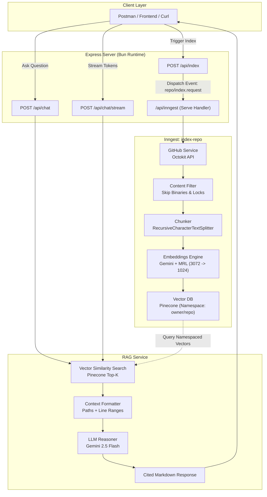

# 🧠 git-wiki

> **An AI-powered Codebase Knowledge Base and Question-Answering Engine.**  
> Ingest any public or private GitHub repository, generate semantic code embeddings, and chat with your codebase using grounded Retrieval-Augmented Generation (RAG) with exact file and line-level citations.

---

## 📑 Table of Contents

- [Overview](#-overview)
- [Architecture](#-architecture)
- [Core Features](#-core-features)
- [Tech Stack](#-tech-stack)
- [Prerequisites & Setup](#-prerequisites--setup)
- [Environment Variables](#-environment-variables)
- [Getting Started](#-getting-started)
- [API Reference](#-api-reference)
  - [1. Index Repository](#1-index-repository)
  - [2. Chat & Q&A (Synchronous)](#2-chat--qa-synchronous)
  - [3. Chat Stream (SSE)](#3-chat-stream-sse)
  - [4. Queue Question (Inngest Async)](#4-queue-question-inngest-async)
  - [5. Health Check](#5-health-check)
- [Engineering Highlights](#-engineering-highlights)
- [Project Structure](#-project-structure)
- [What Can You Build With This?](#-what-can-you-build-with-this)

---

## 🌟 Overview

**git-wiki** solves the developer onboarding and code exploration problem. Instead of spending hours reading through unfamiliar codebases, READMEs, and fragmented documentation, `git-wiki` enables developers to talk directly to any repository.

It crawls a GitHub repository, filters out noise (binaries, lockfiles, dependency trees), splits code into semantically coherent chunks, computes dense vector embeddings using Google Gemini with Matryoshka Representation Learning (MRL), stores them in Pinecone under repository-isolated namespaces, and provides an LLM-backed RAG service via Express APIs and Inngest durable workflows.

---

## 🏗 Architecture



---

## 🚀 Core Features

- 🐙 **Intelligent GitHub Ingestion**: Crawls repositories recursively via Octokit. Automatically filters out images, video, binaries, dependency directories (`node_modules`, `vendor`, `.git`), lockfiles, and environment files (`.env`).
- 🧩 **Semantic Code Splitting**: Utilizes LangChain's `RecursiveCharacterTextSplitter` with line-level location tracking (`loc_from`, `loc_to`) for precise reference resolution.
- 📐 **Matryoshka Representation Learning (MRL)**: Employs `gemini-embedding-001` with mathematical vector dimension reduction (3072 $\rightarrow$ 1024) and L2-normalization, ensuring compatibility with standard Pinecone index dimensions without loss of semantic fidelity.
- 🗄 **Multi-Tenant Vector Namespaces**: Every repository is stored in its own isolated Pinecone namespace (`owner/repo`), enabling clean multi-repo indexing in a single index.
- ⚡ **Durable Background Workflows**: Powered by [Inngest](https://www.inngest.com/) to orchestrate multi-step, retryable, resilient background jobs for long-running repository indexing and asynchronous Q&A.
- 💬 **Multiple Chat Modes**:
  - **Synchronous Q&A**: Direct, immediate answers formatted in Markdown.
  - **Real-Time Streaming**: Token-by-token response streaming using Server-Sent Events (SSE).
  - **Asynchronous Queuing**: Trigger Inngest workflows for high-volume or background execution.
- 📌 **Grounded Citations**: The LLM is strictly prompted to base answers on retrieved snippets and cite exact file paths and line ranges.

---

## 🛠 Tech Stack

| Component | Technology | Description |
| :--- | :--- | :--- |
| **Runtime** | [Bun](https://bun.com/) | High-performance JavaScript/TypeScript runtime & package manager |
| **Framework** | [Express 5](https://expressjs.com/) | REST API server with high-capacity body parsers |
| **Orchestration** | [Inngest](https://www.inngest.com/) | Durable execution engine for background jobs |
| **LLM & Embeddings** | [Google Gemini](https://ai.google.dev/) (`gemini-2.5-flash`, `gemini-embedding-001`) | Fast inference and high-density code embeddings |
| **Vector Database** | [Pinecone](https://www.pinecone.io/) | Serverless vector database with namespace isolation |
| **AI Framework** | [LangChain.js](https://js.langchain.com/) (`@langchain/core`, `@langchain/google-genai`) | Document splitting, prompt templating, and model chaining |
| **Git Client** | [Octokit](https://github.com/octokit/rest.js) | GitHub REST API client for tree traversal and file fetching |

---

## 📋 Prerequisites & Setup

### Prerequisites

- **[Bun](https://bun.sh/)** (v1.1+ recommended) installed on your system.
- **Google AI Studio API Key** (for Gemini LLM and embeddings).
- **Pinecone API Key & Index** (configured with **1024 dimensions** and **Cosine** metric).
- **GitHub Personal Access Token** (optional for public repos, recommended to avoid rate limits; required for private repos).
- **Inngest CLI** (for local background job visualization).

---

## 🔑 Environment Variables

Create a `.env` file in the root directory:

```env
# Server Configuration
PORT=3000

# Google Gemini API
GEMINI_KEY="your_google_gemini_api_key"
# Alternative accepted variable names: GEMINI_API_KEY or GOOGLE_API_KEY
GEMINI_CHAT_MODEL="gemini-2.5-flash"

# Pinecone Vector Database
PINECONE_API_KEY="your_pinecone_api_key"
PINECONE_INDEX="git-wiki"
PINECONE_DIMENSION=1024

# GitHub Authentication (Optional for public repos, required for private)
GITHUB_TOKEN="your_github_personal_access_token"
```

---

## 🏁 Getting Started

### 1. Clone & Install

```bash
git clone https://github.com/TheRealShreyash/git-wiki.git
cd git-wiki
bun install
```

### 2. Start the Development Server

```bash
bun run dev
```

The Express server will start on `http://localhost:3000`.

### 3. Start the Inngest Dev Server (in a separate terminal)

To inspect, run, and replay background indexing workflows locally:

```bash
npx inngest-cli@latest dev -u http://localhost:3000/api/inngest
```

Open your browser to `http://localhost:8288` to view the Inngest Dev Dashboard.

---

## 📡 API Reference

### 1. Index Repository

Triggers background ingestion, chunking, and vector indexing of any GitHub repository.

- **Endpoint**: `POST /api/index`
- **Headers**: `Content-Type: application/json`
- **Request Body**:

```json
{
  "url": "https://github.com/therealshreyash/recoup"
}
```

*Or pass `owner` and `repo` explicitly:*

```json
{
  "owner": "therealshreyash",
  "repo": "recoup",
  "githubToken": "ghp_optionalTokenOverride"
}
```

- **Response (`202 Accepted`)**:

```json
{
  "message": "Repository indexing request queued successfully.",
  "eventId": "01M1HJ2RJESPYE4T3Q9B20JR0J",
  "owner": "therealshreyash",
  "repo": "recoup"
}
```

---

### 2. Chat & Q&A (Synchronous)

Ask questions against an indexed repository and receive an immediate answer with citations.

- **Endpoint**: `POST /api/chat`
- **Headers**: `Content-Type: application/json`
- **Request Body**:

```json
{
  "repo": "therealshreyash/recoup",
  "question": "How does this application handle payments and fee calculation?",
  "k": 8
}
```

| Parameter | Type | Required | Default | Description |
| :--- | :--- | :--- | :--- | :--- |
| `question` | `string` | **Yes** | — | The query or question (aliases: `query`, `message`). |
| `repo` | `string` | **Yes** | — | Repository identifier (`owner/repo` or repository name). |
| `owner` | `string` | No | — | Repository owner if `repo` contains only the repository name. |
| `k` | `number` | No | `5` | Number of most relevant code chunks to retrieve. |
| `modelName`| `string` | No | `gemini-2.5-flash` | Override the default Gemini chat model. |

- **Response (`200 OK`)**:

```json
{
  "question": "How does this application handle payments and fee calculation?",
  "repo": "therealshreyash/recoup",
  "answer": "The application manages payments through server actions defined in `actions/index.ts`. Fee calculations are performed based on transaction tiers...",
  "sources": [
    {
      "path": "src/actions/index.ts",
      "loc_from": 45,
      "loc_to": 78,
      "repo": "therealshreyash/recoup"
    },
    {
      "path": "src/components/transaction-drawer.tsx",
      "loc_from": 12,
      "loc_to": 40,
      "repo": "therealshreyash/recoup"
    }
  ]
}
```

---

### 3. Chat Stream (SSE)

Stream responses in real-time token-by-token using Server-Sent Events.

- **Endpoint**: `POST /api/chat/stream`
- **Headers**: `Content-Type: application/json`
- **Request Body**:

```json
{
  "repo": "therealshreyash/recoup",
  "question": "Summarize the architecture of this repository.",
  "k": 5
}
```

- **Event Stream Output**:

```text
event: sources
data: [{"path":"README.md","loc_from":1,"loc_to":30,"repo":"therealshreyash/recoup"}]

data: {"token":"This"}
data: {"token":" repository"}
data: {"token":" is"}
data: {"token":" structured"}
...
event: done
data: {}
```

---

### 4. Queue Question (Inngest Async)

Queue question processing as a durable Inngest workflow.

- **Endpoint**: `POST /api/chat/queue` (or `POST /api/chat?async=true`)
- **Headers**: `Content-Type: application/json`
- **Request Body**:

```json
{
  "repo": "therealshreyash/recoup",
  "question": "What are all the API routes defined in the project?"
}
```

- **Response (`202 Accepted`)**:

```json
{
  "message": "Question processing queued successfully.",
  "eventId": "01M1HJ3...",
  "question": "What are all the API routes defined in the project?",
  "repo": "therealshreyash/recoup"
}
```

---

### 5. Health Check

- **Endpoint**: `GET /health`
- **Response (`200 OK`)**:
```json
{
  "message": "Healthy"
}
```

---

## ⚙️ Engineering Highlights

### 1. Matryoshka Representation Learning (MRL) Slicing
Gemini's `gemini-embedding-001` natively outputs **3072-dimensional** vectors. Standard serverless vector indexes (like Pinecone free tiers or standard templates) are frequently initialized at **1024 dimensions**.

Instead of requiring index re-creation or complex PCA approximations, `git-wiki` leverages MRL:
```javascript
export function adjustDimension(vector, targetDim = TARGET_DIMENSION) {
  if (!vector || vector.length === targetDim) return vector;
  if (vector.length > targetDim) {
    const sliced = vector.slice(0, targetDim);
    const norm = Math.sqrt(sliced.reduce((sum, val) => sum + val * val, 0));
    return norm > 0 ? sliced.map((val) => val / norm) : sliced;
  }
  return [...vector, ...new Array(targetDim - vector.length).fill(0)];
}
```
Both stored document chunks and search query embeddings pass through this exact transformation, ensuring mathematically consistent cosine similarity.

### 2. Pinecone Schema Sanitization
Pinecone enforces strict constraints on vector metadata: only primitives (`string`, `number`, `boolean`) and lists of strings (`string[]`) are accepted. Nested objects (such as LangChain's `{ loc: { lines: { from: 1, to: 10 } } }`) are automatically converted into top-level primitives (`loc_from`, `loc_to`) via `sanitizeMetadata()`.

### 3. Batched Vector Ingestion
To avoid rate limits and oversized HTTP payloads during upserts, documents are partitioned into batches of 30, embedded incrementally, and committed cleanly to Pinecone.

---

## 📂 Project Structure

```text
git-wiki/
├── src/
│   ├── index.js                      # Express server entry point & middleware
│   ├── inngest/
│   │   ├── client.js                 # Inngest SDK client initialization
│   │   ├── index.js                  # Inngest function exports & registry
│   │   └── functions/
│   │       ├── indexRepo.js          # Multi-step repo ingestion workflow
│   │       ├── askQuestion.js        # Step-based RAG Q&A workflow
│   │       └── helloWorld.js         # Health check test workflow
│   ├── routes/
│   │   ├── index.routes.js           # /api/index routing
│   │   ├── chat.routes.js            # /api/chat sync, queue & stream routing
│   │   └── chat.routes.ts            # TypeScript re-export interface
│   └── service/
│       ├── chunker.js                # Recursive character text splitting
│       ├── github.js                 # Octokit tree traversal & file filtering
│       ├── rag.js                    # Gemini chat chains, prompts & streaming
│       └── vectorStore.js            # Pinecone client, embeddings & MRL logic
├── package.json                      # Dependencies and scripts
├── .env                              # Environment credentials (gitignored)
└── README.md                         # Documentation
```

---

<p align="center">
  Built with ❤️ using Bun, Express, LangChain, Google Gemini, Pinecone, and Inngest.
</p>
